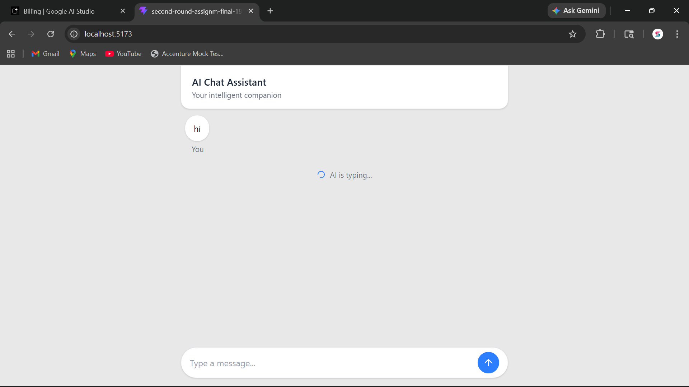
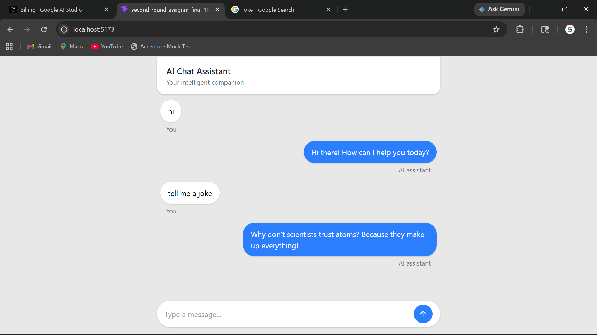

# AI Chatbox Application

A responsive chatbox application built with **React**, **Redux Toolkit**, and **Tailwind CSS** that integrates with the **Google Gemini API** to provide real-time AI responses.

---

## 🚀 Features

- Send messages and receive AI responses in real time
- State management using **Redux Toolkit (Thunk)**
- Loading indicator while waiting for AI response
- Error handling for failed API requests
- Auto-scroll to latest messages
- Responsive UI for both desktop and mobile devices

---

## 🛠️ Tech Stack

- **React**
- **Redux Toolkit (Thunk)**
- **Tailwind CSS**
- **Google Gemini API**
- **Vite**

---

## 📁 Project Structure

```bash
src/
├── components/
│   ├── ChatContainer.jsx
│   ├── Loader.jsx
│   ├── MessageBubble.jsx
│   ├── MessageError.jsx
│   ├── MessageInput.jsx
│   └── MessageList.jsx
├── hook/
│   └── useSendMessage.js
├── reduxSlice/
│   └── messageSlice.js
├── app/
│   └── store.js
├── App.jsx
├── main.jsx
└── index.css
```

---

## ⚙️ Environment Variables

Create a `.env` file in the root directory and add:

```env
VITE_GEMINI_URL=your_api_endpoint_here
VITE_GEMINI_KEY=your_api_key_here
```

---

## 📸 Screenshots

### Chat UI



### AI Response


